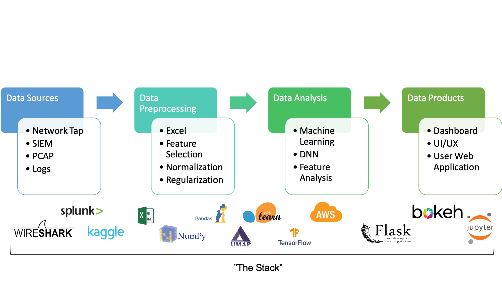
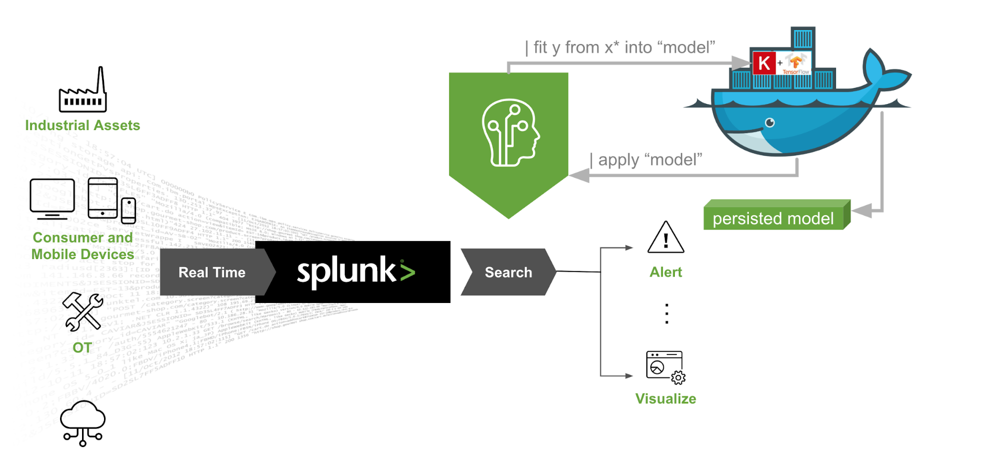

# Network Traffic Data Analysis Toolset
The basis of this project is a small exploration of data analysis techniques and its application to cybersecurity. These notes are meant to outline a rough draft for a set of tools that can be used to move towards applied machine learning in the network traffic analysis and IDS (Intrustion Detection System) space. 

**Question:** What is required to perform applied machine learning in a cybersecurity setting?

## Data Sources and Collection

In cybersecurity, datasources are often comprised of:
1) PCAP files
2) Event Logs
3) Splunk Searches
4) Academic/Research data sources

Splunk provides a quality depiction of how one might use their organization's SIEM as a data source. (https://www.splunk.com/en_us/blog/conf-splunklive/what-s-new-in-the-splunk-machine-learning-toolkit-4-0-part-2.html)

There are a wealth of datasets available online. A popular curated list is linked below.

**Curated Cybersecurity Dataset List**
[https://github.com/jivoi/awesome-ml-for-cybersecurity](https://github.com/jivoi/awesome-ml-for-cybersecurity)

### UNSW-NB15 Dataset

The UNSW-NB15 Dataset can be found here: [https://www.unsw.adfa.edu.au/unsw-canberra-cyber/cybersecurity/ADFA-NB15-Datasets/](https://www.unsw.adfa.edu.au/unsw-canberra-cyber/cybersecurity/ADFA-NB15-Datasets/)

It is what we will use in order to build our machine learning model. The following table defines the fields is provided on the unsw website.

# Sources/Citations
Moustafa, Nour. Designing an online and reliable statistical anomaly detection framework for dealing with large high-speed network traffic. Diss. University of New South Wales, Canberra, Australia, 2017.

Moustafa, Nour, and Jill Slay. "UNSW-NB15: a comprehensive data set for network intrusion detection systems (UNSW-NB15 network data set)." Military Communications and Information Systems Conference (MilCIS), 2015. IEEE, 2015.