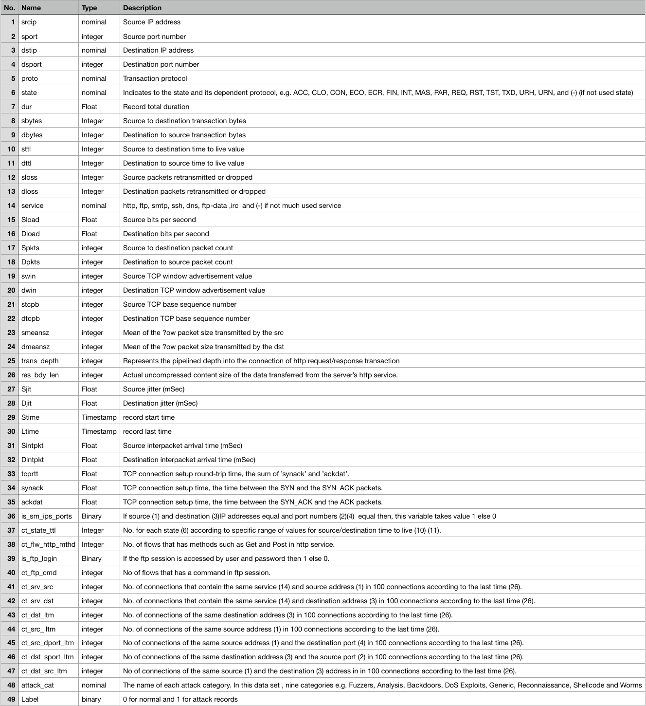
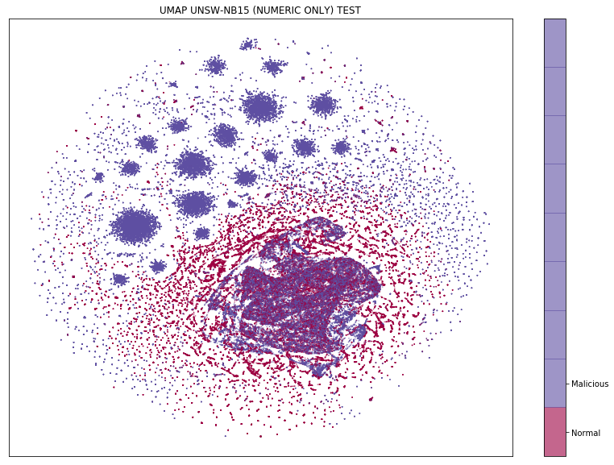

# Table of Contents
- [Network Traffic Data Analysis Project](#network-traffic-data-analysis-project)
- [Data Sources and Collection](#data-sources-and-collection)
  * [UNSW-NB15 Dataset](#unsw-nb15-dataset)
  * [Research on UNSW-NB15](#research-on-unsw-nb15)
- [Data Preprocessing](#data-preprocessing)
  * [Importing CSV into a Pandas Dataframe](#importing-csv-into-a-pandas-dataframe)
  * [Categorical Feature Encoding](#categorical-feature-encoding)
    + [One Hot](#one-hot)
    + [Hash Trick](#hash-trick)
  * [Normalization (Numeric Columns)](#normalization--numeric-columns-)
- [Data Analysis](#data-analysis)
  * [Observing UNSW-NB15 Data with UMAP](#observing-unsw-nb15-data-with-umap)
  * [SKLearn Random Forest on UNSW-NB15](#sklearn-random-forest-on-unsw-nb15)
  * [Tensorflow 2 ANN on UNSW-NB15](#tensorflow-2-ann-on-unsw-nb15)
- [Data Products](#data-products)
- [Sources/Citations](#sources-citations)

<small><i><a href='http://ecotrust-canada.github.io/markdown-toc/'>Table of contents generated with markdown-toc</a></i></small>

# Network Traffic Data Analysis Project
The basis of this project is a small exploration of data analysis techniques and its application to cybersecurity. These notes are meant to outline a rough draft for a set of tools that can be used to move towards applied machine learning in the network traffic analysis and IDS (Intrustion Detection System) space. 

Overall, I am trying to dig into the answer for this question:

**What is required to perform applied machine learning in a cybersecurity setting?**

# Data Sources and Collection

In cybersecurity, datasources are often comprised of:
1) PCAP files
2) Event Logs
3) Splunk Searches
4) Academic/Research data sources

Splunk provides a quality depiction of how one might use their organization's SIEM as a data source. (https://www.splunk.com/en_us/blog/conf-splunklive/what-s-new-in-the-splunk-machine-learning-toolkit-4-0-part-2.html)

There are a wealth of datasets available online. A popular curated list is linked below.

**Curated Cybersecurity Dataset List**
[https://github.com/jivoi/awesome-ml-for-cybersecurity](https://github.com/jivoi/awesome-ml-for-cybersecurity)

## UNSW-NB15 Dataset

The UNSW-NB15 Dataset can be found here: [https://www.unsw.adfa.edu.au/unsw-canberra-cyber/cybersecurity/ADFA-NB15-Datasets/](https://www.unsw.adfa.edu.au/unsw-canberra-cyber/cybersecurity/ADFA-NB15-Datasets/)

It is what we will use in order to build our machine learning model. The following table defines the fields is provided on the unsw website.

The network traffic was synthetically generated in a Cyber Range by the IXIA PerfectStorm tool by the Australian Center for Cybersecurity. The traffic was captured through `tcpdump` (100GB). The packets were then passed into two SIEMs, Argus and BroIDS, in order to generate the features (columns) of this dataset. Some of the 49 total features were calculated with custom algoithms.

A network topology can be found on the unsw-nb15 dataset website and is shown here. It is worth noting the collection point of the tcpdump is depicted on Router 1.

## Research on UNSW-NB15

Now that we have a robust and labeled dataset, it is wise to do some research on it to see how academia has used the data. The analysis done in this project is far more simple, but academic papers often give a good idea on ways to proceed with Data Preprocessing and Analysis. 

Some of the notable papers that informed this project are described here:

1. **Research on Network Intrusion Detection Based on Incremental Extreme Learning Machine and Adaptive Principal Component Analysis**
Jianlei Gao, Senchun Chai *, Baihai Zhang and Yuanqing Xia. School of Automation, Beijing Institute of Technology, Beijing 100081, China; jianleixinye@163.com (J.G.); smczhang@bit.edu.cn (B.Z.); xia_yuanqing@163.net (Y.X.)

> This paper provides descriptions of network traffic IDS integrated with Training/Testing Data sets for a I-ELM and A-PCA models. They are able to get better results in many categories over SVM, BP, and CNN.

2. **Improving the Classification Effectiveness of Intrusion Detection by Using Improved Conditional Variational AutoEncoder and Deep Neural Network**
Yanqing Yang, Kangfeng Zheng, Chunhua Wu and Yixian Yang

> This paper uses an Autocoder to generate an improved dataset before piping it into a CNN. This helps balance the dataset and improves the effectiveness of the neural network.

# Data Preprocessing
Now that we have chosed a dataset, the next step is to process the data in various ways in order to:
1) Get a better understanding of the data
2) Prepare the data for input into machine learning algorithms and neural networks

## Importing CSV into a Pandas Dataframe

Initially the data is in a CSV. Although it is possible to observer the data in excel, it may become somewhat unweildy as the data gets larger in size. Furthermore, we need to turn the data into something our python programs can understand. The `dataframe` class from the Pandas library serves this purpose. It allows us to manipulate and observe the data in an efficient and pipeline-friendly way.

The data is provided as a mix of categorical and numeric data. Some of the columns such as `proto` and `service` are example of categorical data. Example of numeric columns include `smeansz` and `dur`. 

## Categorical Feature Encoding

Since neural networks operate on numeric data, we need to encode the categorical columns. We will use One-Hot encoding and feature hashing depending on the model we are fitting to the data. 

### One Hot Encoding

One Hot encoding allows us to convert each category of a categorical feature into its own feature. This new feature will consist of only 0's or 1's depending on whether or not the given row was the associated category or not.

One-hot graphic from source: https://medium.com/@michaeldelsole/what-is-one-hot-encoding-and-how-to-do-it-f0ae272f1179

We use One-Hot encoding for our Neural Network in the notebook: `UNSW-NB15_PREPROC_NN.ipynb`

A disadvantage on one-hot encoding is that is increases the dimensionality of our dataset by the number of categories in each categorical column. This can make it unsuitable for certain machine learning algorithms. 

As we can see in the figure below, the `proto` category of the unsw-nb15 dataset has quite a few categories.

### Hash Trick Encoding

The hash trick is a method of encoding categorical columns into numeric columns without increasing the dimensionality of the dataset. However, data may be lost during the hashing process. There are many ways to go about hashing the data, we will use the `sklearn.feature_extraction.FeatureHasher` built in function.

The details of the `FeatureHasher` function are described in the SKLearn documentation (https://scikit-learn.org/stable/modules/generated/sklearn.feature_extraction.FeatureHasher.html):
>This class turns sequences of symbolic feature names (strings) into scipy.sparse matrices, using a hash function to compute the matrix column corresponding to a name. The hash function employed is the signed 32-bit version of Murmurhash3.

We use the hash trick in the random forest notebook: `UNSW-NB15_RandomForest.ipynb`

## Normalization (Numeric Columns)
Neural Networks are sensitive to data with features that have large differences in their numeric range. For example, features in the UNSW-NB15 dataset such as `dur` have values in the hundedths and `dbytes` with values in the thousands. 

Normalization is performed in order to ensure that all values in every numeric column are between 0 and 1. This is important in ensuring that no features are overshadowed by others during the NN learning process. To quote wikipedia (https://en.wikipedia.org/wiki/Feature_scaling):

>Since the range of values of raw data varies widely, in some machine learning algorithms, objective functions will not work properly without normalization. For example, many classifiers calculate the distance between two points by the Euclidean distance. If one of the features has a broad range of values, the distance will be governed by this particular feature. Therefore, the range of all features should be normalized so that each feature contributes approximately proportionately to the final distance. 

# Data Analysis
## Observing UNSW-NB15 Data with UMAP

Since our data has high dimentionality, it is difficult to represent it visually. UMAP (Uniform Manifold Approximation and Projection for Dimension Reduction) is a useful library that will help us generate visual representations of the dataset.

According to the UMAP documentation:
>Uniform Manifold Approximation and Projection (UMAP) is a dimension reduction technique that can be used for visualisation similarly to t-SNE, but also for general non-linear dimension reduction. The algorithm is founded on three assumptions about the data
>
 >1.   The data is uniformly distributed on Riemannian manifold;
 >2.   The Riemannian metric is locally constant (or can be approximated as such);
 >3.   The manifold is locally connected.

Using UMAP perform dimension reduction and view the spacial relationships of clusters in the data:

https://github.com/jackg-ch/unswnb15-model-1/blob/master/UMAP_UNSW-NB15_2.ipynb

The resulting plot of the above notebook provides some interesting into the spatial relationships of the data in 2-dimensions.

## SKLearn Random Forest on UNSW-NB15

Source: https://towardsdatascience.com/understanding-random-forest-58381e0602d2

Running SKLearn's RandomForest classifier on UNSW-NB15 Dataset:

https://github.com/jackg-ch/unswnb15-model-1/blob/master/UNSW-NB15_RandomForest.ipynb

## Tensorflow 2 ANN on UNSW-NB15

Implementing a tensorflow 2 neural network for binary classification on UNSW-NB15

https://github.com/jackg-ch/unswnb15-model-1/blob/master/Overall_Demo.ipynb

# Data Products
Current recommendation: Python's Flask Backend with a ReactJS frontend to deliver lightweight and modern AI-driven dashboards.

# Sources/Citations
Moustafa, Nour. Designing an online and reliable statistical anomaly detection framework for dealing with large high-speed network traffic. Diss. University of New South Wales, Canberra, Australia, 2017.

Moustafa, Nour, and Jill Slay. "UNSW-NB15: a comprehensive data set for network intrusion detection systems (UNSW-NB15 network data set)." Military Communications and Information Systems Conference (MilCIS), 2015. IEEE, 2015.
